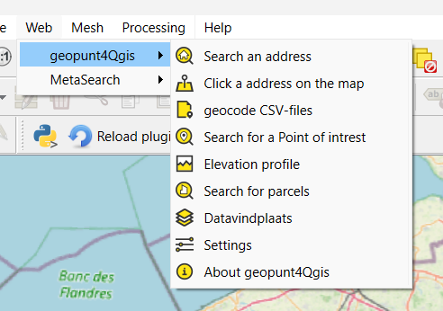
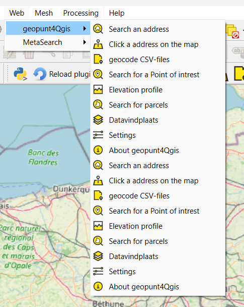
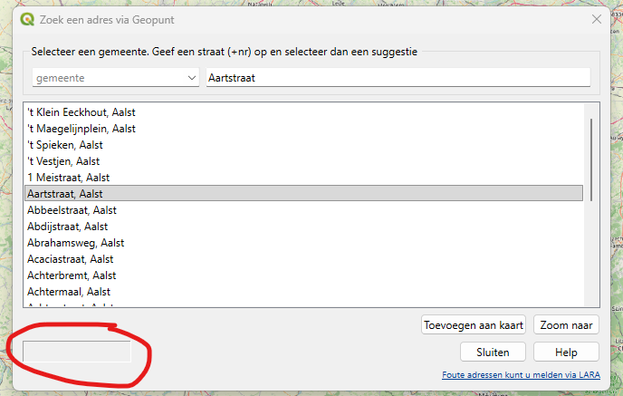
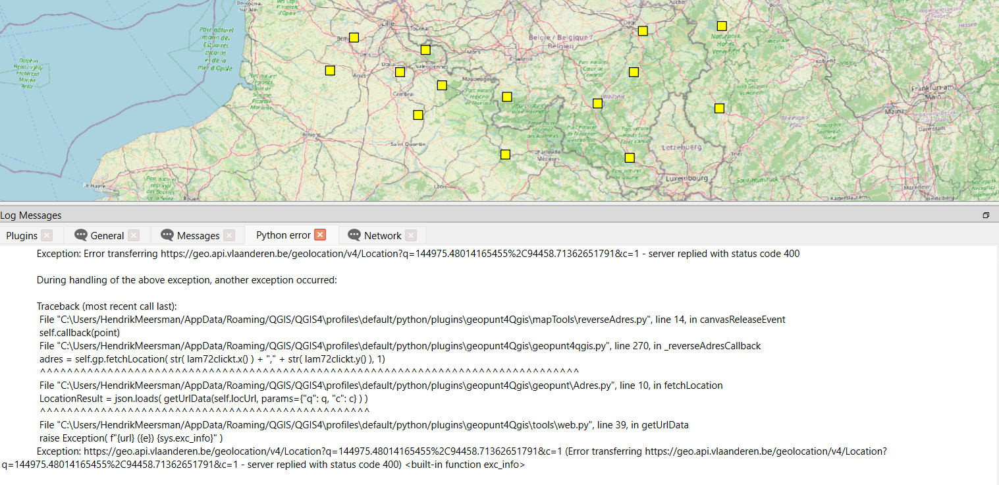
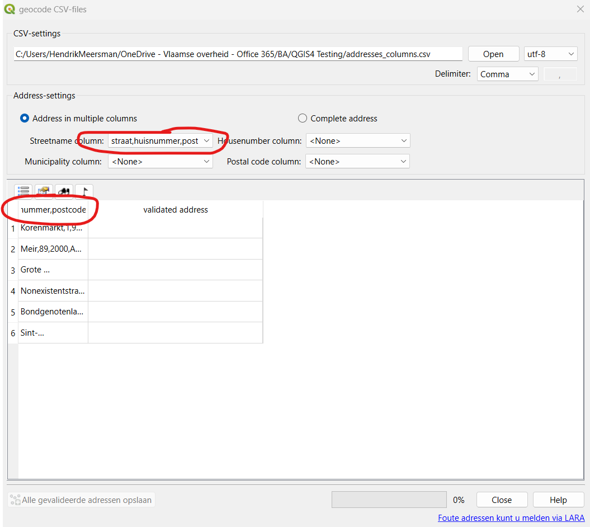
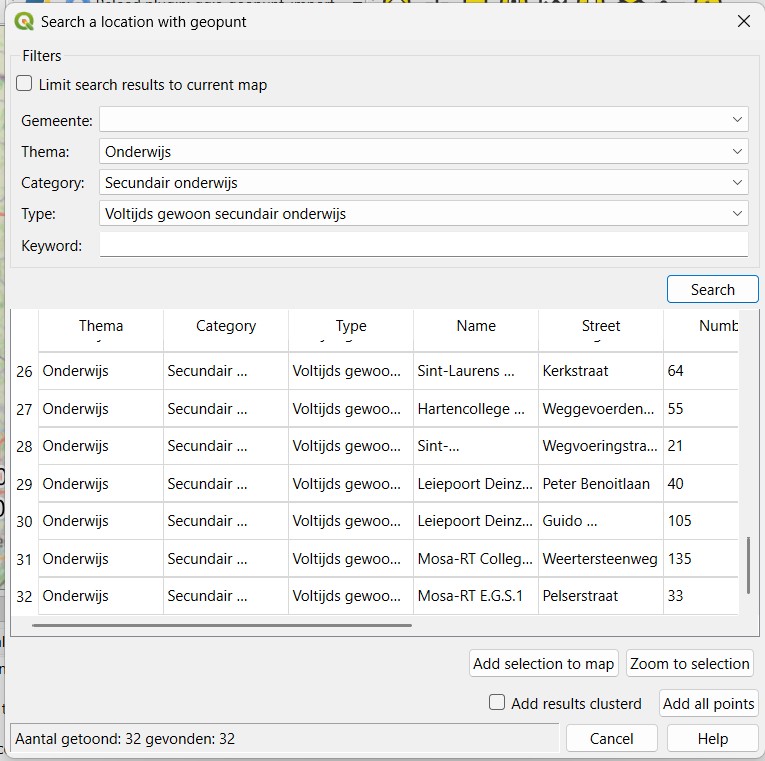
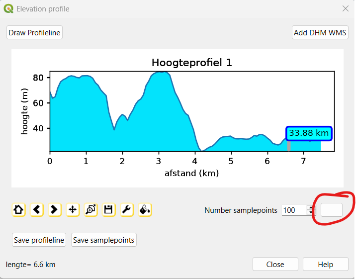
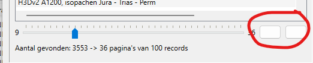

Test results for QGIS4 plugin (geopunt4Qgis) supplied by customers of the Flemish government
====================================================================

> **All tests performed in EPSG:3812 (standard). Some cross-CRS-checked
> with EPSG:31370, 4326 & 3857.**

1. **Plugin disable en re-enable (zonder restart QGIS)**

    a.  Disable the plug-in via the plug-in manager
    b.  Check the menu (Web \> plugin \> ...)
    c.  Buttons are still there:
        {width="4.100355424321959in"
        height="2.8835826771653545in"}
    d.  Re-enable the plugin. Check the menu again.
    e.  Buttons are now double:
        {width="4.042016622922135in"
        height="5.067106299212599in"}
    f.  Restarting QGIS fixes this.

    --> Done, the plugin now disables the menu when the plugin is disabled.

2. **Address**

    a.  Address dialog panel shows empty field?
        {width="4.661194225721784in"
        height="2.9606714785651795in"}
    b.  Not sure if this is used somewhere.

    --> Done, removed

3. **Address**

    a.  Search for a specific address with house number (eg "Gent" \>
        "Korenmarkt 10").
    b.  Double-click a result, or use \"zoom naar\".
    c.  Map only does the panning, not zooming.
    d.  Same issue in EPSG:4326, 3857, 31370
    e.  Note: when using only the street, [without]{.underline} house
        number (eg "Gent" \> "Korenmarkt"), zooming does work.

    --> this becsuse when an single address is returned, no bouding box is returned, so the map cannot zoom to it. It is possoble to fix this by zooming to a fixed scale (eg 1:1000) when a single address is returned.
    Custumer feedback needed: should we zoom to a fixed scale when a single address is returned, or should we not zoom at all (as it is now)? Mabye change te label to "pan of zoom naar" instead of "zoom naar" TODO

4. **Address**

    a.  Switch the address layer from memory to a permanent file
        (GeoPackage) with a custom name and folder.
    b.  Click \"Toevoegen aan kaart\" for another result.
    c.  Python error, address is not added:
        ```
            2026-08-21T09:56:12     WARNING    Traceback (most recent
            call last):\

                          File
            \"C:\\Users/HendrikMeersman/AppData/Roaming/QGIS/QGIS4\\profiles\\default/python/plugins\\geopunt4Qgis\\geopunt4QgisAdresdialog.py\",
            line 137, in onAdd2mapKnopClick\
                          self.\_addToMap(item.text())\
                          File
            \"C:\\Users/HendrikMeersman/AppData/Roaming/QGIS/QGIS4\\profiles\\default/python/plugins\\geopunt4Qgis\\geopunt4QgisAdresdialog.py\",
            line 189, in \_addToMap\
                          self.gh.save_adres_point( pt, adres,
            typeAddress=LocationType,\
                          File
            \"C:\\Users/HendrikMeersman/AppData/Roaming/QGIS/QGIS4\\profiles\\default/python/plugins\\geopunt4Qgis\\tools\\geometry.py\",
            line 177, in save_adres_point\
                          self.adresProvider.addFeatures(\[fet\])\
                         RuntimeError: wrapped C/C++ object of type
            QgsVectorDataProvider has been deleted
        ```
    --> This scenario was not indaad not considered. The issue is that the address layer becomes a new layer, when the user changes the layer from memory to a permanent file. TODO

5. **Address:**

    a.  Toggle \"search on Enter\" instead of \"search on edit\" in
        Settings.
    b.  Address dialog doesn't respect it (still live search while
        typing).

    --> this setting was obsolete, the search is now always on edit as service is now more responsive then in the past.
    -->  the setting has been removed from the settings dialog. TODO

6. **Reverse geocoding:**

    a.  \"Prik een adres op de kaart\", same Python error as 3.c

    --> Idem to 3.c, when a user saves the temporary layer to a permanent file, a new layer is created. TODO

7. **Reverse geocoding:**

    a.  Mouse is stuck at the \"Prik een adres op de kaart\" tool.
    b.  Have to click other QGIS tool (e.g. pan map) to get "out" of the
        reverse geocoding tool.

    --> Tested, mouse not stuck, the tool is still active until the user clicks another tool. This is the expected behavior. It is possible to change this behavior, but it is not a bug. TODO

8. **Reverse geocoding:**

    a.  Click outside Flanders (sea, France, Netherlands).
    b.  Python error instead of a warning message. Yellow square symbols
        don't dissappear:
        {width="5.33379593175853in"
        height="2.58752624671916in"}
    c.  Same issue in EPSG:4326, 3857, 31370

    --> Better warning message is now shown.

9. **Batch geocoding**

    a.  Open the batch dialog, browse to **addresses_columns.csv**, set
        separator = comma, encoding = UTF-8.
    b.  column-mapping controls not working:
        {width="5.721580271216098in"
        height="5.108554243219597in"}

    --> addresses_columns.csv has semicolon as separator, not comma. The user should select the correct separator in the dialog. TODO

10. **POI**

    a.  Search for POI's.
    b.  Double-click a result, or use \"zoom naar\".
    c.  Map only does the panning, not zooming. (Same bug as 2.c)

    --> Same as 2.c, when an single POI is returned, no bouding box is returned, so the map cannot zoom to it. It is possoble to fix this by zooming to a fixed scale (eg 1:1000) when a single POI is returned. Alternatively, I can also just change the label to "pan of zoom naar" instead of "zoom naar". TODO

11. **POI**

    a.  Search for POI's with \> 32 results
    b.  Results "Getoond" en "Gevonden" stuck at 32 max (there are more
        then 32 schools):
        {width="4.748799212598425in"
        height="4.724195100612423in"}

    --> this the preview based on the first 32 results, but the total number of results is shown in the status bar (see below). The add button wiill add all results to the map, not only the first 32.

12. **Elevation:**

    a.  Line-draw tool not showing the line while drawing.

    --> Done, a blue line is now shown while drawing, the line already drawn remains red.

13. **Elevation:**

    a.  Refresh profile: missing button text:
        {width="3.5938527996500436in"
        height="2.8158541119860017in"}
    
    --> Done, added icon to the button

14. **Elevation:**

    a.  A line drawn (partly or completely) outside Flanders / over
        water where DHM has no data gives Python error (instead of
        generic message that data isn't available):

        ```
        Traceback (most recent call last):\
                          File
            \"C:\\Users/HendrikMeersman/AppData/Roaming/QGIS/QGIS4\\profiles\\default/python/plugins\\geopunt4Qgis\\mapTools\\elevationProfile.py\",
            line 41, in canvasDoubleClickEvent\
                          self.callback( self.rubberBand )\
                          File
            \"C:\\Users/HendrikMeersman/AppData/Roaming/QGIS/QGIS4\\profiles\\default/python/plugins\\geopunt4Qgis\\geopunt4QgisElevation.py\",
            line 301, in maptoolCallBack\
                          self.plot()\
                          File
            \"C:\\Users/HendrikMeersman/AppData/Roaming/QGIS/QGIS4\\profiles\\default/python/plugins\\geopunt4Qgis\\geopunt4QgisElevation.py\",
            line 277, in plot\
                          ymin = np.min( \[n\[3\] for n in self.profile
            if n\[3\] \> -9999 \] )\
                          \^\^\^\^\^\^\^\^\^\^\^\^\
                         TypeError: \'\>\' not supported between
            instances of \'NoneType\' and \'int\'
        ```
    --> Done, a better warning message is now shown when the profile contains no valid data.

15. **Datavindplaats:**

    a.  Buttons for "previous" and "next" page with results are missing
        labels:
        {width="4.350377296587927in"
        height="0.883409886264217in"}
    
    --> Done, added icons to the buttons

16. **Settings dialog:**

    a.  Toggle the GIPOD checkbox to a state that differs from the
        current POI checkbox (e.g. "Save to [file]{.underline}" for POI
        and "Save to [temporary layer]{.underline}" for GIPOD).
    b.  Save, close QGIS entirely, then reopen Settings.
    c.  Checkboxes for GIPOD and POI are the same state again.

    --> POI tool not saving is fixed.
    --> Gipod has been removed from the plugin, so this is no longer relevant.
    --> I have now also removed the Gipod entry in the settings dialog
